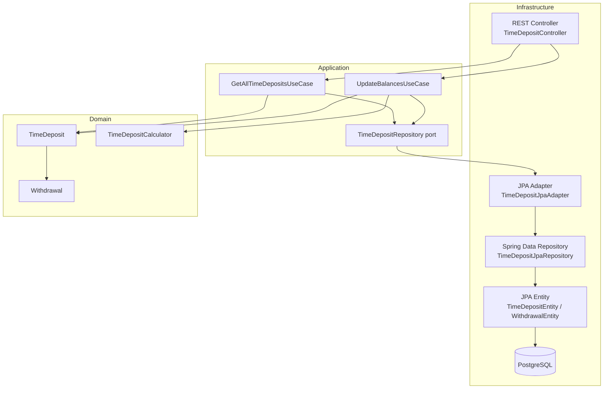

# Design Document: time-deposit-api

## Overview

The time-deposit-api wraps the existing `TimeDeposit` / `TimeDepositCalculator` domain logic in a Spring Boot 3.x REST service backed by PostgreSQL. The application exposes two endpoints:

- `GET /time-deposits` — returns all time deposits with their associated withdrawals.
- `POST /time-deposits/update-balances` — applies monthly interest to every time deposit and persists the result.

The codebase follows **Hexagonal Architecture** (Ports & Adapters): the domain layer has zero framework dependencies, the application layer defines use-case ports, and the infrastructure layer provides Spring/JPA adapters. The existing `TimeDeposit` class and `TimeDepositCalculator.updateBalance` signature are preserved without modification.

---

## Architecture



### Layer Responsibilities

| Layer | Package | Responsibility |
|---|---|---|
| Domain | `org.ikigaidigital.domain` | `TimeDeposit`, `Withdrawal`, `TimeDepositCalculator` — pure Java, no framework deps |
| Application | `org.ikigaidigital.application` | Use-case classes, `TimeDepositRepository` port interface |
| Infrastructure | `org.ikigaidigital.infrastructure` | Spring MVC controller, JPA entities, Spring Data repositories, adapter implementations |

---

## Components and Interfaces

### Domain Layer

**`TimeDeposit`** (existing — unchanged)
```java
// org.ikigaidigital.TimeDeposit  (kept in original package)
public class TimeDeposit {
    public TimeDeposit(int id, String planType, Double balance, int days) { ... }
    public int getId(); public String getPlanType();
    public Double getBalance(); public int getDays();
    public void setBalance(Double balance);
}
```

**`Withdrawal`** (new domain value object)
```java
// org.ikigaidigital.domain.Withdrawal
public record Withdrawal(int id, int timeDepositId, Double amount, LocalDate date) {}
```

**`TimeDepositCalculator`** (existing — unchanged)
```java
public class TimeDepositCalculator {
    public void updateBalance(List<TimeDeposit> xs) { ... }
}
```

### Application Layer

**`TimeDepositRepository`** port (interface)
```java
// org.ikigaidigital.application.port.TimeDepositRepository
public interface TimeDepositRepository {
    List<TimeDeposit> findAll();
    void saveAll(List<TimeDeposit> deposits);
}
```

**`GetAllTimeDepositsUseCase`**
```java
// org.ikigaidigital.application.usecase.GetAllTimeDepositsUseCase
public class GetAllTimeDepositsUseCase {
    List<TimeDeposit> execute();
}
```

**`UpdateBalancesUseCase`**
```java
// org.ikigaidigital.application.usecase.UpdateBalancesUseCase
public class UpdateBalancesUseCase {
    void execute();  // loads → updateBalance → saveAll
}
```

### Infrastructure Layer

**`TimeDepositController`** (REST adapter)
```java
// org.ikigaidigital.infrastructure.rest.TimeDepositController
@RestController
@RequestMapping("/time-deposits")
public class TimeDepositController {
    @GetMapping          ResponseEntity<List<TimeDepositResponse>> getAll();
    @PostMapping("/update-balances")  ResponseEntity<Void> updateBalances();
}
```

**`TimeDepositJpaAdapter`** (implements `TimeDepositRepository` port)
```java
// org.ikigaidigital.infrastructure.persistence.TimeDepositJpaAdapter
@Component
public class TimeDepositJpaAdapter implements TimeDepositRepository {
    List<TimeDeposit> findAll();
    void saveAll(List<TimeDeposit> deposits);
}
```

**`TimeDepositJpaRepository`** / **`WithdrawalJpaRepository`** (Spring Data)
```java
interface TimeDepositJpaRepository extends JpaRepository<TimeDepositEntity, Integer> {}
interface WithdrawalJpaRepository extends JpaRepository<WithdrawalEntity, Integer> {}
```

### Response DTOs

```java
// org.ikigaidigital.infrastructure.rest.dto
public record TimeDepositResponse(
    int id, String planType, Double balance, int days,
    List<WithdrawalResponse> withdrawals
) {}

public record WithdrawalResponse(
    int id, int timeDepositId, Double amount, LocalDate date
) {}
```

---

## Data Models

### Database Schema

```sql
CREATE TABLE time_deposits (
    id       INTEGER PRIMARY KEY,
    plan_type VARCHAR(50)    NOT NULL,
    days     INTEGER         NOT NULL,
    balance  DECIMAL(19, 2)  NOT NULL
);

CREATE TABLE withdrawals (
    id               INTEGER PRIMARY KEY,
    time_deposit_id  INTEGER        NOT NULL REFERENCES time_deposits(id),
    amount           DECIMAL(19, 2) NOT NULL,
    date             DATE           NOT NULL
);
```

Schema is initialised via Spring Boot's `spring.jpa.hibernate.ddl-auto=create-drop` in tests and `validate` in production, with a `schema.sql` file for explicit DDL.

### JPA Entities

**`TimeDepositEntity`**
```java
@Entity @Table(name = "time_deposits")
public class TimeDepositEntity {
    @Id Integer id;
    @Column(name = "plan_type") String planType;
    Integer days;
    BigDecimal balance;
    @OneToMany(mappedBy = "timeDeposit", cascade = CascadeType.ALL, fetch = FetchType.EAGER)
    List<WithdrawalEntity> withdrawals;
}
```

**`WithdrawalEntity`**
```java
@Entity @Table(name = "withdrawals")
public class WithdrawalEntity {
    @Id Integer id;
    @ManyToOne @JoinColumn(name = "time_deposit_id") TimeDepositEntity timeDeposit;
    BigDecimal amount;
    LocalDate date;
}
```

### Domain ↔ Entity Mapping

The `TimeDepositJpaAdapter` is responsible for mapping between `TimeDepositEntity` ↔ `TimeDeposit` and `WithdrawalEntity` ↔ `Withdrawal`. The domain `TimeDeposit` carries a `List<Withdrawal>` via a thin wrapper — the adapter enriches the domain object after loading.

Since `TimeDeposit` has no `withdrawals` field, the adapter returns a subclass or companion record `TimeDepositWithWithdrawals` that extends the response model, keeping the domain class untouched.

**Design decision**: Rather than polluting the domain `TimeDeposit` with a withdrawals list, the application layer uses a `TimeDepositView` record (in the application package) that pairs a `TimeDeposit` with its `List<Withdrawal>`. The use case returns `List<TimeDepositView>` for the GET endpoint, while `UpdateBalancesUseCase` works only with `List<TimeDeposit>` as required by the calculator.

```java
// org.ikigaidigital.application.model.TimeDepositView
public record TimeDepositView(TimeDeposit deposit, List<Withdrawal> withdrawals) {}
```

---

## Correctness Properties

*A property is a characteristic or behavior that should hold true across all valid executions of a system — essentially, a formal statement about what the system should do. Properties serve as the bridge between human-readable specifications and machine-verifiable correctness guarantees.*

### Property 1: GET endpoint returns all deposits with correct shape

*For any* set of time deposits (and their associated withdrawals) stored in the database, calling `GET /time-deposits` should return HTTP 200 with a JSON array whose length equals the number of stored deposits, and each element must contain the fields `id`, `planType`, `balance`, `days`, and `withdrawals` — where each withdrawal contains `id`, `timeDepositId`, `amount`, and `date`.

**Validates: Requirements 4.2, 4.3, 4.4, 9.3**

---

### Property 2: Update-balances persists correct interest to the database

*For any* set of time deposits in the database, calling `POST /time-deposits/update-balances` should result in each deposit's balance in the database being equal to the balance that `TimeDepositCalculator.updateBalance` would compute for that deposit — i.e., the API is a round-trip: load → calculate → persist → reload yields the calculated value.

**Validates: Requirements 5.4, 9.2**

---

### Property 3: Zero-interest conditions

*For any* time deposit where one of the following conditions holds — (a) `days` ≤ 30 regardless of plan type, (b) `planType` is `student` and `days` ≥ 366, or (c) `planType` is `premium` and `days` ≤ 45 — calling `updateBalance` should leave the balance unchanged (interest = 0).

**Validates: Requirements 6.1, 6.4, 6.6**

---

### Property 4: Basic plan interest calculation

*For any* time deposit with `planType` = `basic` and `days` > 30, calling `updateBalance` should increase the balance by exactly `balance × 0.01 / 12` rounded to 2 decimal places (HALF_UP).

**Validates: Requirements 6.2**

---

### Property 5: Student plan interest calculation

*For any* time deposit with `planType` = `student`, `days` > 30, and `days` < 366, calling `updateBalance` should increase the balance by exactly `balance × 0.03 / 12` rounded to 2 decimal places (HALF_UP).

**Validates: Requirements 6.3**

---

### Property 6: Premium plan interest calculation

*For any* time deposit with `planType` = `premium` and `days` > 45, calling `updateBalance` should increase the balance by exactly `balance × 0.05 / 12` rounded to 2 decimal places (HALF_UP).

**Validates: Requirements 6.5**

---

## Error Handling

| Scenario | HTTP Status | Behaviour |
|---|---|---|
| `GET /time-deposits` — no records | 200 | Empty JSON array `[]` |
| `POST /time-deposits/update-balances` — no records | 200 | No-op; returns empty body |
| Database unavailable | 500 | Spring default error response; no custom handling required at this stage |
| Unknown endpoint | 404 | Spring default |

The application does not expose mutation endpoints for individual deposits in this iteration, so 4xx validation errors are not in scope beyond the above.

---

## Testing Strategy

### Dual Testing Approach

Both unit tests and property-based tests are required and complementary:

- **Unit tests** cover specific examples, edge cases, and integration points.
- **Property-based tests** verify universal rules across many generated inputs.

### Unit Tests

Focus areas:
- `TimeDepositCalculator` existing tests (must continue to pass — no changes).
- Mapper logic: `TimeDepositEntity` ↔ `TimeDeposit` ↔ `TimeDepositView` conversions.
- Use-case orchestration with mocked repository port.
- Controller layer with MockMvc: correct HTTP status codes and response structure.
- OpenAPI endpoint availability (`/swagger-ui/index.html`, `/v3/api-docs`).
- ArchUnit test: domain layer has no imports from `org.springframework` or `jakarta.persistence`.

### Property-Based Tests

**Library**: [jqwik](https://jqwik.net/) (Java property-based testing library for JUnit 5).

Each property test must run a minimum of **100 iterations** (jqwik default is 1000 — keep default).

Each test must be tagged with a comment referencing the design property:
> `// Feature: time-deposit-api, Property N: <property_text>`

| Test | Design Property | Approach |
|---|---|---|
| For any list of deposits in DB, GET returns all with correct fields | Property 1 | Generate random `TimeDepositEntity` lists, seed DB, call endpoint, assert shape |
| For any list of deposits, POST update-balances persists calculator result | Property 2 | Generate random deposits, seed DB, call endpoint, reload from DB, compare with direct `updateBalance` call |
| For any deposit in zero-interest conditions, balance is unchanged | Property 3 | Generate deposits with `days` ≤ 30, student `days` ≥ 366, premium `days` ≤ 45; assert balance unchanged |
| For any basic deposit with days > 30, interest = balance × 0.01 / 12 | Property 4 | Generate random balances for basic plan, assert formula |
| For any student deposit with 30 < days < 366, interest = balance × 0.03 / 12 | Property 5 | Generate random balances for student plan in range, assert formula |
| For any premium deposit with days > 45, interest = balance × 0.05 / 12 | Property 6 | Generate random balances for premium plan, assert formula |

### Integration Tests (Testcontainers)

- Use `@Testcontainers` + `@Container` with `PostgreSQLContainer` from `org.testcontainers:postgresql`.
- Spring Boot test slice: `@SpringBootTest(webEnvironment = RANDOM_PORT)` with `TestRestTemplate` or `MockMvc`.
- `@DynamicPropertySource` injects the container's JDBC URL into Spring context.
- Two integration test scenarios:
  1. Seed deposits → `GET /time-deposits` → assert response body matches seeded data.
  2. Seed deposits → `POST /time-deposits/update-balances` → query DB directly → assert balances match calculator output.

### Maven Dependencies to Add

```xml
<!-- Spring Boot parent -->
<parent>
    <groupId>org.springframework.boot</groupId>
    <artifactId>spring-boot-starter-parent</artifactId>
    <version>3.3.x</version>
</parent>

<!-- Core -->
<dependency>spring-boot-starter-web</dependency>
<dependency>spring-boot-starter-data-jpa</dependency>
<dependency>postgresql (runtime)</dependency>

<!-- OpenAPI -->
<dependency>
    <groupId>org.springdoc</groupId>
    <artifactId>springdoc-openapi-starter-webmvc-ui</artifactId>
    <version>2.x</version>
</dependency>

<!-- Test -->
<dependency>spring-boot-starter-test (includes JUnit 5, AssertJ, MockMvc)</dependency>
<dependency>org.testcontainers:postgresql</dependency>
<dependency>org.testcontainers:junit-jupiter</dependency>
<dependency>net.jqwik:jqwik (property-based testing)</dependency>
<dependency>com.tngtech.archunit:archunit-junit5 (architecture tests)</dependency>
```
